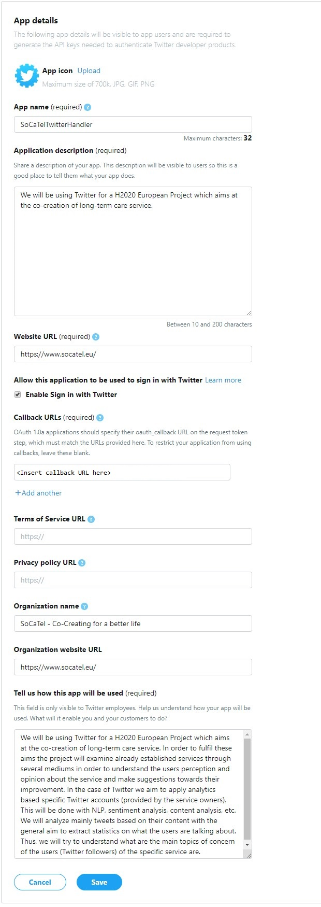

# **OAUTH Server**

This is the OAuth server implementation which is responsible for acting as a medium between the `socatel-oauth` (AngularJS module `socatel-oauth`) resource registration form and all of OSNs APIs (For now **ONLY** Twitter is supported). Its purpose is to perform all necessary GET/POST requests to the OSN (Online Social Network) and responding back to the `socatel-oauth` with the appropriate oauth key/secret, necessary for performing user/account/group/page specific requests. Register an official application with Twitter to replicate this and fill in the provided credentials in the `config.py` file.

The OAuth Server is developed using:

  - [Python 3](https://www.python.org/downloads/) - Programming Language
  - [Falcon API](https://falconframework.org/) - Middleware Framework
  - [requests_oauth_lib](https://github.com/requests/requests-oauthlib) - OAUth1 Requests Library
  - [gunicorn](https://gunicorn.org/) - Microframework for web development
  

### **Run the API locally**

##### Install the requirements

Make sure you have Python 3 installed. Then, navigate to the directory path `~/oauth_server` and run the following command in a terminal:
```
pip install -r requirements.txt
```

##### Run the API
Run the service using the following command (localhost):
```
gunicorn -b localhost:5000 server:api --reload 
```

Run the service using the following command (server):
```
gunicorn -b server_ip_address:port_number server:api --reload
```
In  the terminal you should see the following response:

```
 * Staring gunicorn 
 * Listening at http://localhost:5000/
```

Now the service runs on localhost and listens to the port `5000`. To stop service press `CTRL+C`

### **Implementation Walk-through**
* Code uses and exposes logs for audit purposes and helping developers understand any potential error that may occur
* CORS (Cross Origin Resource Sharing) is enabled to not restricting access from another origin, ensuring that the proxy
 may accept requests from any `socatel-oauth` location
* The [configuration](config.py) file contains consumer key/secret of SoCaTel authorized Twitter app. These tokens have 
to be used with `discretion`. The tokens are used when performing authorized requests on the Twitter API.

### **SignIn with Twitter - Guidelines**
[Implementing Sign In with twitter](https://developer.twitter.com/en/docs/twitter-for-websites/log-in-with-twitter/guides/implementing-sign-in-with-twitter) guide is strictly followed. The steps are also presented below and are also divided in 3 distinct steps in OAuthServer

#### Step 1  - GetOauthRequestToken `/twitter_oauth/request_token`
This API is responsible for performing an OAuth1 session request to twitter using the consumer key/secret. The Twitter 
responds back with an oauth_token, oauth_token_secret and oauth_callback_confirmed. All 3 returned items are being sent 
back to the `socatel-oauth` as a response. Which is then used by the `socatel-oauth` to perform an HTTP GET for asking 
user to authorize SoCaTelTwitterHandler app. Prior returning the response to user, the oauth obtained info will be
 stored
 in a dictionary called oauth_verifiers with oauth_token as a key. The dictionary is used next.

#### Step 2  - OAuthCallback `/twitter_oauth/oauth_callback`
After user successful performs the HTTP GET call mentioned above and approves the SoCaTelTwitterHandler application, 
twitter then redirects user to our HTTP endpoint of OAuthCallback and it also sends the `oauth_token` and 
`oauth_verifier` . Thus, this API call is responsible of accepting the `oauth_token` and `oauth_verifier`. The 
`oauth_verifier` is then stored along with all other information was obtained in the previous step within the 
aforementioned dictionary using as key the `oauth_token`. If no such `oauth_token` is known then an appropriate HTML 
file will be send back as a response. In case of both success (`oauth_token` is present) or failure (`oauth_token` is 
not present) then the HTML files being returned and rendered back contain a JS script that will close the window after 5
 seconds. This will help us identify within the AngularJS popup that the popup is closes and this will enable the 
 mechanism to proceed to Step 3, in which the o`oauth_token` and `oauth_verifier` will be transformed to user-specific 
 `oauth_token` and `oauth_secret`.

#### NOTICE ###
```diff
- IMPORTANT
- For this to work, you must authorize the URI endpoint as a callback URL within your app's settings. The following image shows the application details for the SoCaTel project as an example.
```


#### Step 3  - ConvertToAccessToken `/twitter_oauth/convert_to_access_token/{oauth_token}`
The `socatel-oauth` AngularJS Service will then use this API call and send the oauth_token which along with the `oauth_verifier` are sent to Twitter and the user-specific `oauth_token` and `oauth_secret` are being generated and being sent back as a response.

## **Contact**
If you encounter any problems, please contact the following:

[](mailto:info@cyric.eu)

## License

[Apache-2.0](../../LICENSE)
